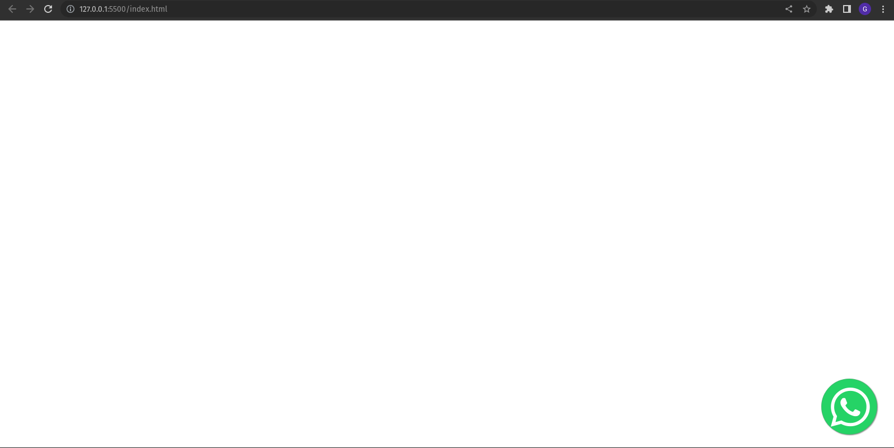

# Whatsapp-Web-Page
Botão flutuante do Whatsapp para Páginas Web estáticas em HTML puro e CSS.

## Layout
Aplicável em projetos web com responsividade.

### Desktop

### Mobile

## Como incluir no projeto ?
### head HTML
- Inserir a *tag meta* para compatibilidade *mobile*.
- Inserir as duas *tags* da CDN BootStrap.

### body HTML
- Inserir a *tag* ``, com a classe 'whatsapp-link' no projeto.
- Incluir o número do Whatsapp com código do país (DDI), código local (DDD), e o telefone. Logo após o `href="https://api.whatsapp.com/send?phone="`.

### CSS
- Incluir o conteudo do arquivo style.css no arquivo .css do projeto.

## Tecnologias utilizadas
- HTML 5;
- CSS 3;
- BootStrap;

# Autor

Guilherme Setim

